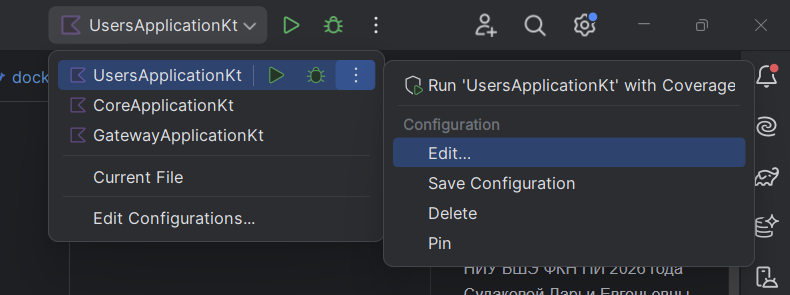
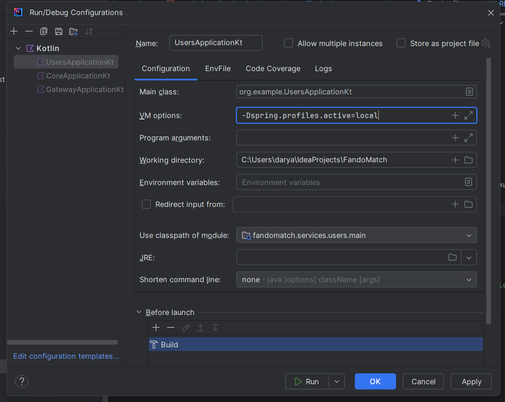

# FandoMatch
Дипломная работа студентки НИУ ВШЭ ФКН ПИ 2026 года Судаковой Дарьи Евгеньевны.

# Описание
Серверная часть проекта FandoMatch 

## Как запустить тесты
Командой ``./gradlew clean test jacocoTestReport``

## Как запустить DEV / LOCAL среду
0. _**Предусловия:**_  Наличие скачанных PGadmin, docker desktop, опциональьно bruno для запросов к серверу
1. Склонировать репозиторий
2. Сгенерировть API клиенты. Для этого из корня проекта запускаем команду  ``.\gradlew.bat openApiGenerate``
3. Создать базы данных. Для этого в PG Admin создаем БД с названиями и паролями ровно как указано в application.yaml каждого из сервисов в папке ``services``. Создаем таблицы с помощью SQL скриптов из папок `services/{service_name}/resources/db.migration`
4. Запускаем кафку с помощью команды из корня проекта ``docker compose up --build kafka``
5. Стартуем приложения в таком порядке: users, core, gateway. Для того чтобы нужный профиль подтянулся, делаем следующее: в конфигурации в Intelij Idea нажимаем `edit` -> `VM Options` -> вставляем строчку `-Dspring.profiles.active=local` -> `apply`   
   Так делаем для каждой конфигурации и потом запускаем. 
6. Локальный профиль готов! Можно делать запросы, вероятно только через postman/bruno

## Как запустить UAT среду
**ВАЖНО!** Обязательно нужно выключить все прокси/ВПН перед запуском, иначе не получится запустить докер.
0. _**Предусловия:**_ Запускаем/скачиваем [Ехидного кита для десктопа](https://www.docker.com/products/docker-desktop/).
1. Далее в корень проекта нужно положить файл под названием ``.env`` с секретами. Секреты я дам.
2. _**(Опционально, в случае ошибок в следующих пунктах - иначе можно смело скипать)**_ Убеждаемся что в папках ``clients/..`` лежит папка ``build``. Ее я не дам, ее нужно сгенерить командой ``.\gradlew.bat openApiGenerate``
2. Запускаем из корня проекта команду:
   - ``docker compose up --build`` - если билдим в первый раз
   - ``docker compose up`` - если уже сегодня сбилдили и не хотим ждать снова/если нет изменений в репозитории и образ актуален
   - ``docker compose up -d`` - если не хотим видеть логи добавляем к любой из команд флаг -d
Когда проект поднимется - можно делать запросы через bruno (его я тоже могу дать), например, или с вашего мобильного клиента.
Тут сохраняются тестовые пользаки
## Media Flow

### Пример 1 — сообщение с картинкой

```
1. POST /media/presigned-upload  { media_type: IMAGE }
   ← { media_id, upload_url, expires_at }
2. PUT {upload_url}  ← байты файла
3. POST /messaging/chats/{user_id}/send
   → { content, media_ids: ["<id>"], timestamp }
4. POST /messaging/chats/{user_id}/messages
   ← { messages: [{ content, media_items: [{ media_id, media_type: IMAGE, url: "<signed>" }] }] }
```

### Пример 2 — аватар профиля

```
1. POST /media/presigned-upload  { media_type: IMAGE }
   ← { media_id, upload_url, expires_at }
2. PUT {upload_url}  ← байты файла
3. PATCH /core/user/profile/edit
   → { avatar_media_id: "<id>" }
4. POST /core/user/profile
   ← { avatar: { media_id, media_type: IMAGE, url: "<signed>" } }
```
