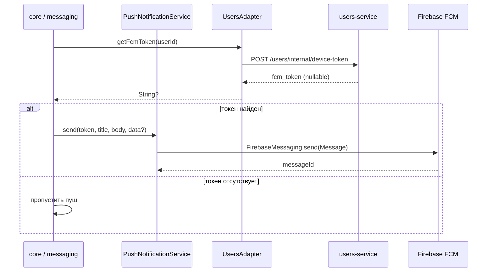

# notifications-lib

Обёртка над Firebase Admin SDK для отправки FCM push-уведомлений. Подключается к `core` и `messaging` как Spring Boot auto-configuration.

---

## Переменные окружения

| Переменная | Описание | Где взять |
|---|---|---|
| `FIREBASE_CREDENTIALS_JSON` | Service account JSON целиком (в одну строку) | Firebase Console → Project Settings → Service accounts → **Generate new private key** |
| `FIREBASE_PROJECT_ID` | ID проекта Firebase | Firebase Console → Project Settings → **Project ID** |

### Как получить Service Account JSON

1. Открыть [Firebase Console](https://console.firebase.google.com)
2. Выбрать проект → шестерёнка → **Project Settings**
3. Вкладка **Service accounts**
4. Нажать **Generate new private key** → скачать `.json`
5. Содержимое файла сжать в одну строку (убрать переносы) и передать как `FIREBASE_CREDENTIALS_JSON`

> Для локальной разработки можно передавать через `.env` или `application-local.yaml`:
> ```yaml
> notifications:
>   firebase:
>     credentials-json: '{"type":"service_account","project_id":"...",...}'
>     project-id: my-project-id
> ```

---

## Флоу отправки уведомлений



---

## Когда отправляются пуши

| Событие | Кто отправляет | Получатель |
|---|---|---|
| Пользователь лайкнул профиль | `core` → `MatchesService.react()` | лайкнутый пользователь |
| Взаимный лайк (матч) | `core` → `MatchesService.react()` | оба пользователя |
| Новое сообщение в чате | `messaging` → `ChatsService.sendMessage()` | получатель сообщения |

---

## Структура модуля

```
notifications-lib/
├── NotificationsConfig.kt            # @ConfigurationProperties("notifications.firebase")
├── NotificationsAutoConfiguration.kt # создаёт FirebaseApp бин
└── PushNotificationService.kt        # send(token, title, body, data?)
```

`FirebaseMessagingException` при отправке **не пробрасывается** — логируется и подавляется, чтобы не прерывать основной флоу.
