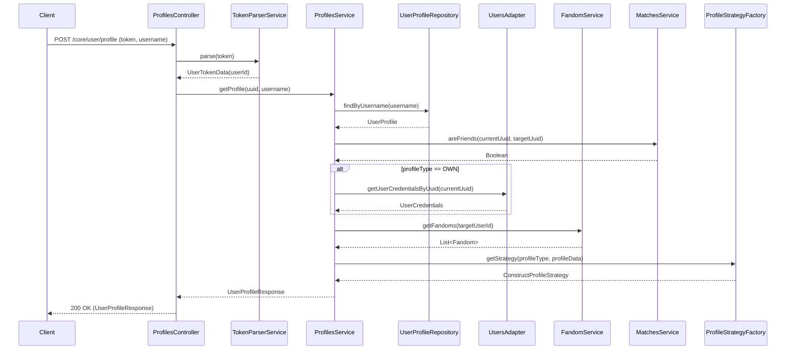
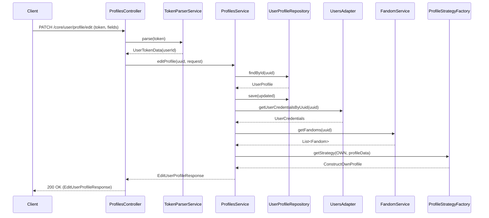
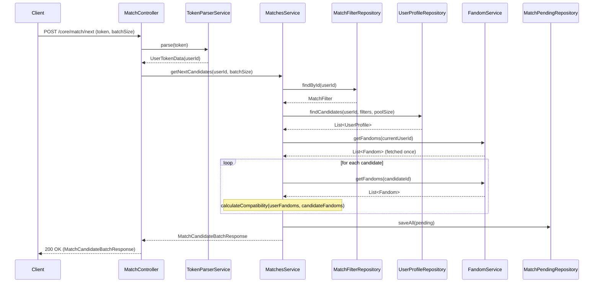
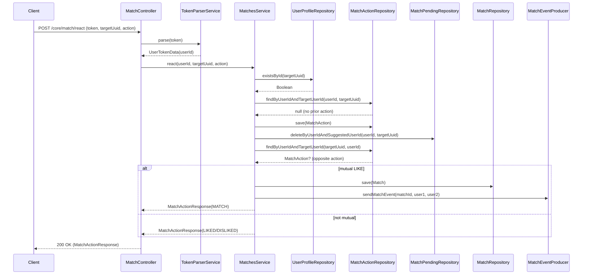
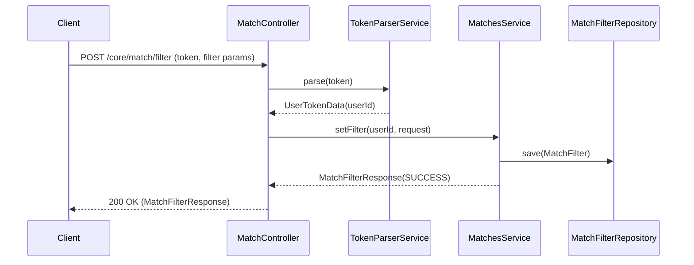

# Core Service

Core service handles user profiles and matching logic.

## Endpoints

### User Profile

#### `POST /core/user/profile` — getProfile

#### `PATCH /core/user/profile/edit` — editProfile

### Matching

#### `POST /core/match/next` — getNextCandidates

#### `POST /core/match/react` — react

#### `POST /core/match/filter` — setFilter

