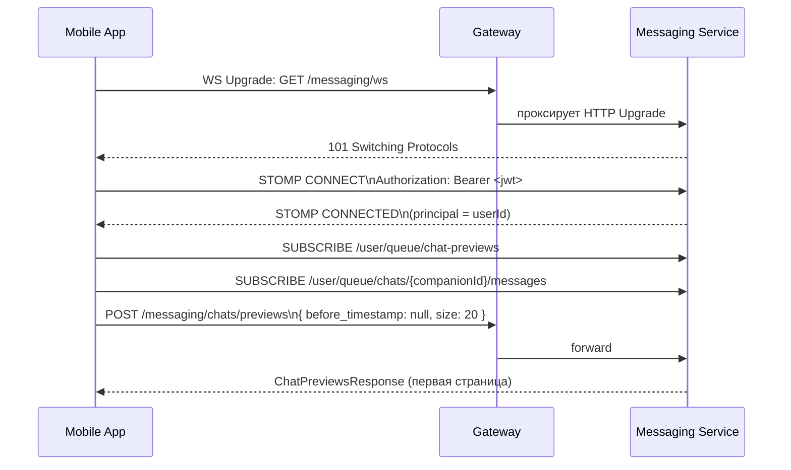
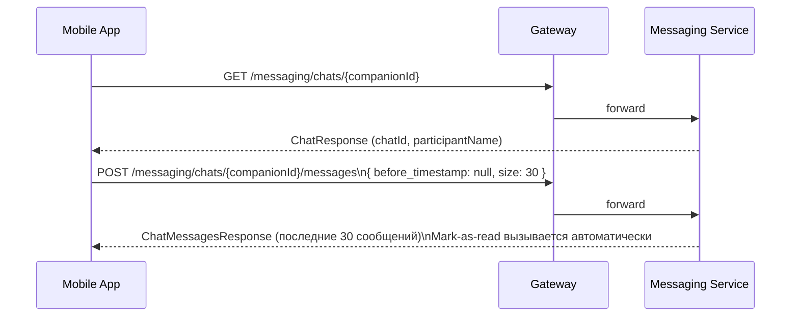
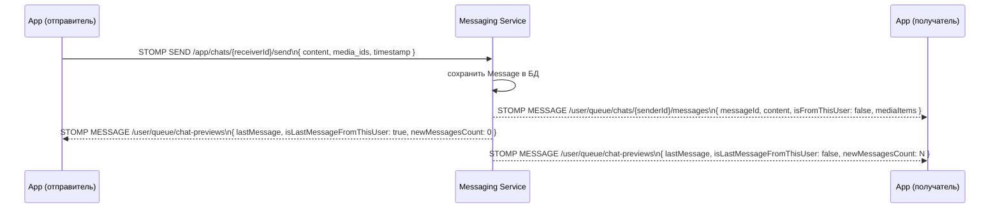
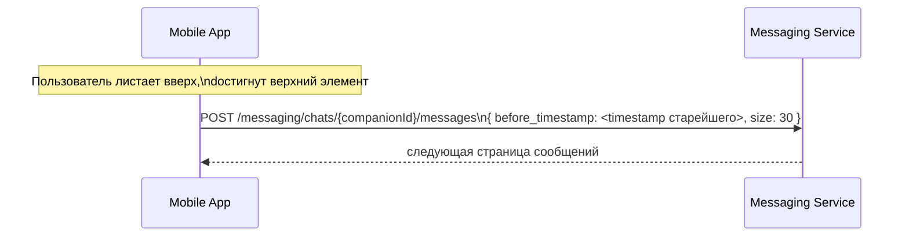

# Messaging Service

Сервис для обмена сообщениями между пользователями. Поддерживает REST API для начальной загрузки данных и WebSocket (STOMP) для обновлений в реальном времени.

---

## REST API

| Метод | Путь | Описание |
|-------|------|----------|
| `POST` | `/messaging/chats/previews` | Список чатов с пагинацией |
| `GET` | `/messaging/chats/{userId}` | Загрузить / создать чат |
| `POST` | `/messaging/chats/{userId}/messages` | История сообщений с пагинацией |
| `POST` | `/messaging/chats/{userId}/send` | Отправить сообщение (REST fallback) |
| `POST` | `/messaging/media/presigned-upload` | Получить presigned URL для загрузки медиа |

Пагинация курсорная — передаётся `before_timestamp` последнего полученного элемента.

---

## WebSocket (STOMP)

### Адреса

| Направление | Адрес | Описание |
|-------------|-------|----------|
| клиент → сервер | `/app/chats/{targetUserId}/send` | Отправить сообщение |
| сервер → клиент | `/user/queue/chat-previews` | Обновление превью чата |
| сервер → клиент | `/user/queue/chats/{senderId}/messages` | Новое сообщение от пользователя |

### Аутентификация

JWT передаётся в заголовке STOMP-фрейма `CONNECT`:
```
Authorization: Bearer <token>
```

После успешного коннекта идентификатор пользователя извлекается из токена и привязывается к сессии. Все подписки (`/user/queue/...`) автоматически изолированы по этому идентификатору.

---

## Флоу подключения к WebSocket

### Шаг 1 — Установка соединения и подписка

Клиент открывает экран со списком чатов:



### Шаг 2 — Открытие конкретного чата



### Шаг 3 — Отправка сообщения



### Шаг 4 — Подгрузка истории (бесконечный скролл)



---

## Медиа-флоу

Медиафайлы загружаются напрямую в S3 через presigned URL, сервис хранит только `media_id`.

```
1. POST /messaging/media/presigned-upload  { media_type: IMAGE }
   ← { media_id, upload_url, expires_at }

2. PUT {upload_url}  ← байты файла (напрямую в S3)

3. SEND /app/chats/{receiverId}/send
   → { content: "смотри", media_ids: ["<media_id>"], timestamp }

4. Получатель получает push:
   ← { content, mediaItems: [{ media_id, media_type: IMAGE, url: "<signed_download_url>" }] }
```

Signed download URL генерируется сервером в момент ответа и действует ограниченное время (настраивается через `media.s3.download-ttl-minutes`).
