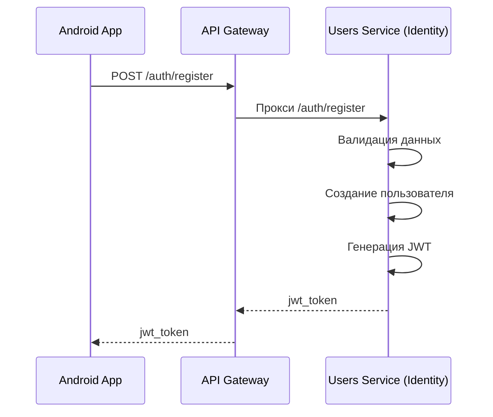

# Сервис users
## Как генерить open api спеки?
Командой ``.\gradlew.bat openApiGenerate``
Иногда нужно две попытки для успешной генерации
Как запустить тесты
./gradlew clean test jacocoTestReport (--continue)  
./gradlew :services:users:clean :services:users:test :services:users:jacocoTestReport

# Диаграммы последовательностей

## Регистрация

